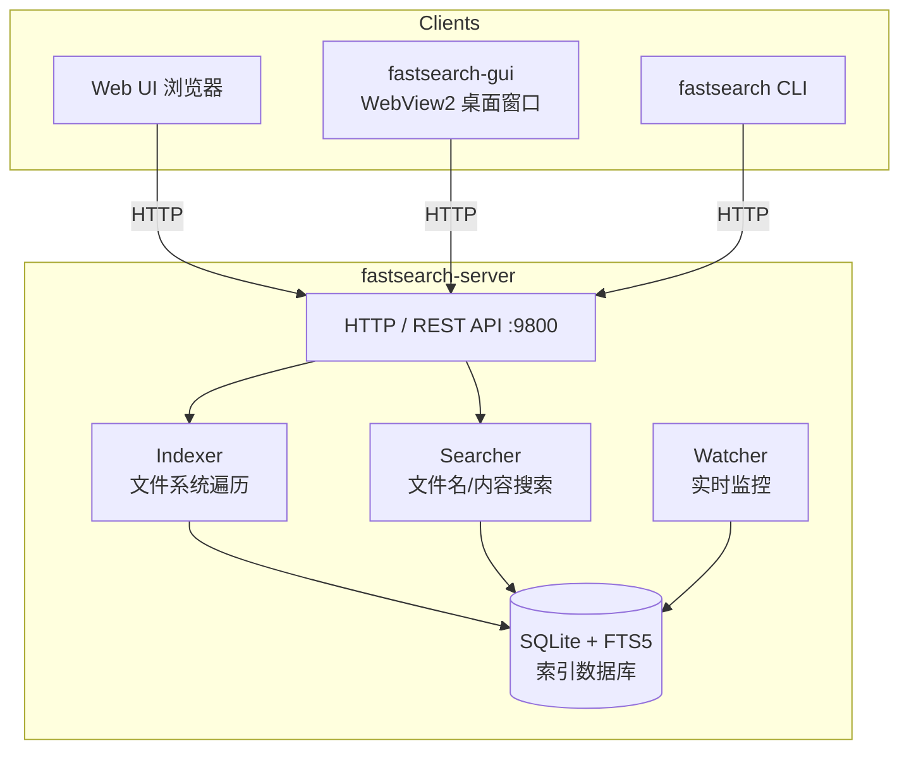

# FastSearch - 高性能本地文件搜索工具

类似 Everything 的高性能文件搜索工具，支持文件名搜索和文件内容搜索，提供 Web UI、桌面 GUI、CLI 三种客户端。

## 特性

- **极速文件名搜索** - SQLite FTS5 全文索引 + LIKE 模糊匹配，大小写无关
- **拼音搜索** - 支持中文文件名的拼音首字母搜索
- **文件内容搜索** - 全文 grep，自动跳过二进制文件
- **实时文件监控** - 自动检测文件变更，增量更新索引（支持多路径并发监控）
- **离线变更同步** - 服务重启时自动同步离线期间的文件增删改
- **Web UI** - 现代暗色紧凑主题，结果列表占据主视野，实时搜索
- **桌面 GUI** - WebView2 独立应用（Windows），原生右键菜单；**单例**（再次启动只把已有窗口置前，含托盘恢复）；用户数据在 `%LocalAppData%\FastSearch\WebView2Data`，避免装在 `Program Files` 时黑屏
- **原生右键菜单** - 与资源管理器一致的 shell 菜单（打开 / 属性 / 发送到 / 删除 等均支持），额外置顶了"打开路径"与"复制文件路径和文件名"
- **原地重命名** - 右键重命名在列表行内直接进入编辑态（类似 Everything / Explorer F2），默认只选中主名，基于 `IFileOperation` 写回，支持 UAC 提权与资源管理器的 `Ctrl+Z` 撤销
- **CLI** - 命令行快速搜索
- **Windows 服务** - 支持作为 Windows 系统服务开机自启
- **中文路径支持** - 完整支持 UTF-8 中文文件名和路径
- **跨平台** - Windows / Linux / macOS

## 构建

### 依赖

- CMake >= 3.16
- C++17 编译器 (MSVC / GCC / Clang)
- Windows: Visual Studio 2019+ （GUI 客户端需要 WebView2 Runtime，Win10 2004+ 已预装）

### 编译

```bash
mkdir build && cd build
cmake ..
cmake --build . --config Release
```

### Windows (Visual Studio)

```bash
cmake -B build
cmake --build build --config Release
```

编译产物位于 `build/Release/`：

- `fastsearch-server.exe` - HTTP 服务端
- `fastsearch.exe` - CLI 客户端
- `fastsearch-gui.exe` - 桌面 GUI 客户端（Windows，含图标与版本信息）
- `WebView2Loader.dll` - GUI 依赖（与 GUI exe 一同分发）

#### 图标资源

GUI 图标位于 `res/`：

- `res/fastsearch.ico` - 打包进可执行文件的多分辨率 ICO（由 `src/gui/fastsearch.rc` 引用）
- `res/build_icon.py` - 从原图生成多尺寸 ICO 的辅助脚本（依赖 Pillow）

### Windows 安装包

项目自带基于 **Inno Setup 6** 的 Windows 安装包脚本，位于 `installer/`：

- `installer/fastsearch.iss` - 安装程序脚本（中英双语、支持服务注册、PATH、桌面 / 开始菜单快捷方式）
- `installer/build_installer.ps1` - 一键构建：重新编译 Release → 调用 `ISCC` 生成安装包
- `installer/LICENSE.txt` / `readme-before-install.txt` - 向导里展示的许可 / 说明页
- `installer/dist/` - 输出目录（已在 `.gitignore` 中忽略）

构建方式：

```powershell
# 首次会自动通过 winget 安装 Inno Setup 6（如已装则跳过）
powershell -ExecutionPolicy Bypass -File installer\build_installer.ps1

# 若已有 Release 产物、只想重打安装包
powershell -ExecutionPolicy Bypass -File installer\build_installer.ps1 -SkipBuild
```

产物为 `installer/dist/FastSearch-Setup-<version>.exe`。安装向导支持：

- 选择是否注册 `FastSearchService`（默认勾选，开机自启并立即启动）
- 选择是否创建桌面快捷方式（默认勾选）
- 选择是否将安装目录加入系统 `PATH`（默认不勾选）
- 卸载时自动停止并反注册服务、清理旧版 `Program Files` 下及 `%LocalAppData%` 中的 WebView2 数据目录（索引数据库和日志仍保留在各自配置路径）

## 使用

### 启动 Server（控制台模式）

```bash
# 索引所有驱动器（默认）
./fastsearch-server

# 指定索引目录
./fastsearch-server D:/projects E:/data

# 指定端口
./fastsearch-server --port 8080

# 打开浏览器访问 http://127.0.0.1:9800
```

### Windows 服务模式

以管理员身份在 PowerShell / CMD 中运行：

```powershell
# 安装为 Windows 服务（开机自启）
.\fastsearch-server.exe --install

# 启动 / 停止 / 查询
sc start FastSearchService
sc stop  FastSearchService
sc query FastSearchService

# 卸载服务
.\fastsearch-server.exe --uninstall
```

服务模式下日志写入 `%LOCALAPPDATA%/fastsearch/fastsearch-service.log`。

### 桌面 GUI

双击 `fastsearch-gui.exe` 打开桌面窗口（需要 server 正在运行）。

WebView2 用户数据目录为 `%LocalAppData%\FastSearch\WebView2Data`（**不是**安装目录下的 `*.WebView2`），以便在 `Program Files` 安装时普通用户也能写入缓存与配置，避免界面黑屏。

**单例**：再次运行 `fastsearch-gui`（或点击快捷方式）时不会启动第二进程，而是将已有主窗口**置于前台**（含最小化到任务栏/隐藏到托盘的恢复）。

```bash
# 连接到自定义地址
./fastsearch-gui.exe --url http://192.168.1.10:9800
```

若 server 未运行，GUI 会显示离线提示页面，点击 Retry 可重试连接。

#### 右键菜单与原地重命名

在结果列表上右键任意条目，会弹出与 Windows 资源管理器一致的 shell 菜单，顶部依次是：

1. **打开** - 调用 shell 默认动词（文件默认动作 / 进入文件夹），加粗显示
2. **打开路径** - 在资源管理器中定位到该文件
3. **复制文件路径和文件名** - 拷贝完整路径到剪贴板

其他项（剪切、复制、发送到、属性、压缩、扩展菜单的 Git / VSCode 等）均由 shell 扩展原样提供。

选择"重命名"时**不会弹对话框**，而是在列表行内直接把文件名变成可编辑输入框（文件默认只选中主名，文件夹全选）：

- `Enter` 提交
- `Esc` / 失焦 取消
- 写回使用 `IFileOperation`，需要权限时会触发 UAC，重命名结果纳入资源管理器的 `Ctrl+Z` 撤销栈

### CLI 搜索

```bash
# 文件名搜索
./fastsearch "readme.md"
./fastsearch "*.cpp" --ext cpp

# 内容搜索
./fastsearch --content "TODO" --ext py

# 查看状态
./fastsearch --status
```

## 架构



## 配置

配置文件位置：

- Windows: `%LOCALAPPDATA%/fastsearch/config.json`
- Linux/macOS: `~/.config/fastsearch/config.json`

数据库位置：

- Windows: `%LOCALAPPDATA%/fastsearch/index.db`
- Linux/macOS: `~/.local/share/fastsearch/index.db`

## API

| 方法 | 路径 | 说明 |
| --- | --- | --- |
| GET | `/` | Web UI 首页 |
| GET | `/api/search?q=&limit=&offset=&ext=&path=&regex=&sort=&order=&type=` | 文件名搜索 |
| GET | `/api/search/content?q=&path=&ext=&limit=` | 内容搜索 |
| GET | `/api/stats` | 索引统计信息 |
| POST | `/api/index` | 手动重建索引 |
| GET | `/api/config` | 获取配置 |
| PUT | `/api/config` | 更新索引路径 / 排除规则 |
| GET | `/api/open?path=` | 在系统资源管理器中打开文件所在位置 |

## 许可

MIT
